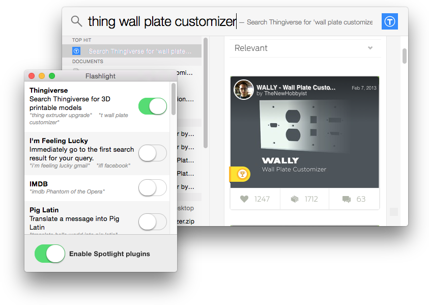

#Thingiverse.com plugin for Flashlight



This is a Thingiverse.com search plugin for the "<a href="http://flashlight.nateparrott.com/">Flashlight</a>" plugin system for Spotlight on Mac OS X

##Installation
1. Install **<a href="http://flashlight.nateparrott.com/">Flashlight</a>**
2. Run **Flashlight** once to create library folders
3. Quit **Flashlight**
4. Drop thing.bundle into ```~/Library/FlashlightPlugins```
5. Relaunch **Flashlight**

##Usage
1. Open Flashlight.
2. Toggle on the Thingiverse plugin.
3. Start a search with "t" or "thing" in Spotlight.

##Notes
This plugin was creating using **Flashlight's** shop.thing as a template.

